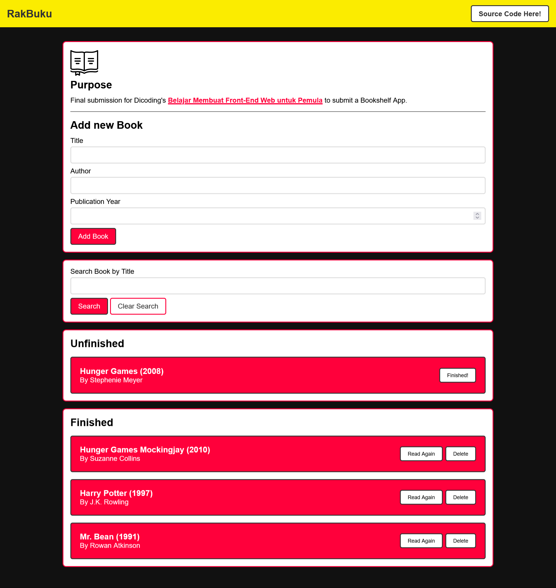

# Description

This is the final project of Dicoding's [Belajar Membuat Front-End Web untuk Pemula](https://www.dicoding.com/academies/315), the goal is to create a bookshelf App in web with the help of Local Storage to make it more saveable.

## Required Conditions

1. Has to be able to save/add new book to read with following properties:
   - id:timestamp, Generated
   - title:string, Input from user
   - author:string, Input from user
   - year:number, Input from user
   - isComplete:boolean, Generated set to false
2. Has to have 2 shelves; Both respectably are unfinished read book and already finished read book
3. Has to be able to move either from already finished read book and unfinished read book
4. Has to be able to delete/remove book from the shelves
5. Has to implement Web Storage, specifically localStorage. As for the features it has to be able to retrieve and parse books.

Which I did fulfill all of the requirements.

## Additional Conditions/Optional

1. Implement search feature to display which book user's looking for from both shelves
2. Not using the already pre-made starter boilerplate from Dicoding
3. Write the code with Clean Code in mind:
   - Remove comments and unnecessary codes
   - Proper indentation
4. Has feature improvement, such as:
   - Custom dialog to remove a book
   - The feature to edit a book
   - etc.

I also implemented all the additional conditions trying to achieve the perfect score!

## Preview

If you'd like to preview the web live, please visit through [this link](https://fajar13k.github.io/belajar-membuat-frontend-web-untuk-pemula/)

## Screenshot

